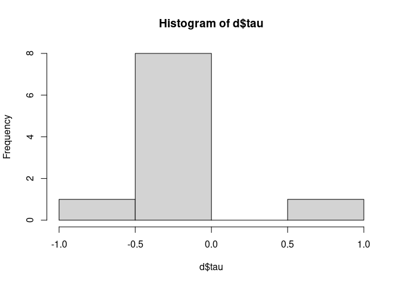

Problem Set 1
================
Alex, Micah, and Scott
12/01/2020

``` r
library(data.table)

knitr::opts_chunk$set(echo = TRUE)
```

# Potential Outcomes Notation

1.  Explain the notation \(Y_i(1)\).  
    
    **Answer:**  \(Y_i(1)\) is the potential outcome if the ith subject
    were treated.

2.  Explain the notation \(Y_1(1)\).  
    
    **Answer:**  \(Y_1(1)\) is the potential outcome if the 1st subject
    were treated.

3.  Explain the notation \(E[Y_i(1)|d_i=0]\).  
    
    **Answer:**  Expectation of potential outcome if one subject is
    selected at random from the set of treated subjects.

4.  Explain the difference between the notation \(E[Y_i(1)]\) and
    \(E[Y_i(1)|d_i=1]\)  
    
    **Answer:**  Expected value of Y\_i(1) (i.e. potential outcome if
    the ith subject were treated) when one subject is sampled at random
    from all samples.  
    Expected value of Y\_i(1) when one subject is sampled at random from
    the set of all treated subjects  
    The latter is a conditional expectation, which refers to subgroup
    averages. In this case, the difference between both expressions that
    the former is expected value of potential outcomes of a randomly
    treated subject, sampled from all possible samples. The latter is
    expression for expected value of potential outcome of a treated
    subject sampled only from the set of treated samples.

# Potential Outcomes and Treatment Effects

1.  Use the values in the table below to illustrate that
    \(E[Y_i(1)]-E[Y_i(0)] = E[Y_i(1)- [Y_i(0)]\).
    
    **Answer:**  Since we have a simple table of a small set of
    observations, we are here assuming that this is a sample of unbiased
    estimators of potential outcomes for the control and the treatment.
    The expected values is the mean of those properties. Here we are
    taking mean of each of the values. We also illustrate that the
    average treatment effect (mean Tau) is equal to the difference of
    the expected values of potential outcomes of treatment and control
    estimators.

<!--
R code practice: ways to calculate probability for each element in a dataframe: 
table[,count_y_0 := .N, by="y_0"]
table[,count_y_1 := .N, by="y_1"]
table[,prob_y_0 := count_y_0 / length(y_0)]
table[,prob_y_1 := count_y_1 / length(y_1)]
table[, E_Y0 := y_0 * prob_y_0]
table[, E_Y1 := y_1 * prob_y_1]
-->

``` r
mean(table$y_1) - mean(table$y_0)
```

    ## [1] 2

``` r
mean(table$y_1 - table$y_0)
```

    ## [1] 2

``` r
mean(table$tau)
```

    ## [1] 2

All shown here, both expressions equal to expected value of `2`.

2.  Is it possible to collect all necessary values and construct a table
    like the one below in real life? Explain why or why not.  
    
    **Answer:**  It is not possible to construct a table of such values
    in real life because the potential outcome for each record is
    mutually exclusive in a population. We either treat a village or
    not. The only way to construct such a table would be to create a
    table by random selection from the population. A random selection
    would ensure that the control and treatment groups are unbiased
    estimators of the original population.

# Visual Acuity

Suppose we are interested in the hypothesis that children playing
outside leads them to have better eyesight.

Consider the following population of ten children whose visual acuity we
can measure.

  - Visual acuity is the decimal version of the fraction given as output
    in standard eye exams.
  - Someone with 20/20 vision has acuity 1.0, while someone with 20/40
    vision has acuity 0.5.
  - Numbers greater than 1.0 are possible for people with better than
    “normal” visual acuity.

<!-- end list -->

``` r
library(data.table)

d <- data.table(
  child = 1:10, 
  y_0 = c(1.2, 0.1, 0.5, 0.8, 1.5, 2.0, 1.3, 0.7, 1.1, 1.4), 
  y_1 = c(1.2, 0.7, 0.5, 0.8, 0.6, 2.0, 1.3, 0.7, 1.1, 1.4)
)
```

In this table:

  - `y_1` means means the measured *visual acuity* if the child were to
    play outside at least 10 hours per week from ages 3 to 6’  
  - `y_0` means the measured *visual acuity* if the child were to play
    outside fewer than 10 hours per week from age 3 to age 6;
  - Both of these potential outcomes *at the child level* would be
    measured at the same time, when the child is 6.

<!-- end list -->

1.  Compute the individual treatment effect for each of the ten
    children.

<!-- end list -->

``` r
d[, tau:= (y_1 - y_0)]
d
```

    ##     child y_0 y_1  tau
    ##  1:     1 1.2 1.2  0.0
    ##  2:     2 0.1 0.7  0.6
    ##  3:     3 0.5 0.5  0.0
    ##  4:     4 0.8 0.8  0.0
    ##  5:     5 1.5 0.6 -0.9
    ##  6:     6 2.0 2.0  0.0
    ##  7:     7 1.3 1.3  0.0
    ##  8:     8 0.7 0.7  0.0
    ##  9:     9 1.1 1.1  0.0
    ## 10:    10 1.4 1.4  0.0

``` r
hist(d$tau)
```

<!-- -->

2.  Tell a “story” that could explain this distribution of treatment
    effects. In particular, discuss what might cause some children to
    have different treatment effects than others.  
    
    **Answer:**  We see only two children have different treatment
    effects in this observation set (2nd and 5th kids) while the
    treatment effects for remaining children is zero. Moreover, we see
    that treatment effects for 2nd and 5th kids are opposite. Hence we
    cannot infer any meaningful causal effect from this observational
    study. There could be number of reasons why the two children have
    different treatment effects (i.e. congenital vision defects,
    acquired vision acuity conditions owing to diets due to income
    differences between both households etc). Hence we are not able to
    create a definitive story because a number of confounding factors
    need to be eliminated first (which may require a much bigger sample
    size and a much better level of experimental intervention for a
    meaningful study).

3.  For this population, what is the true average treatment effect (ATE)
    of playing outside.

<!-- end list -->

``` r
mean(d$tau)
```

    ## [1] -0.03

4.  Suppose we are able to do an experiment in which we can control the
    amount of time that these children play outside for three years. We
    happen to randomly assign the odd-numbered children to treatment and
    the even-numbered children to control. What is the estimate of the
    ATE you would reach under this assignment? (Please describe your
    work.)  
    
    **Answer:** first divide the children into subgroups (odd and even
    numbered kids) and create an additional column called `treat` which
    marks `0` for even numbered kids and `1` for odd numbered kids.  
    Then we also create an additional column to store the potential
    outcomes for treatment and control groups (similar to how we divided
    kids as treatment and control groups in first step).  
    We now simply calculate the ATE using condition on `treat` column
    (marking children as control and treatment) and the value stored in
    `Y` columns.

<!-- end list -->

``` r
d[, treat := ifelse(test = (child %% 2 == 0), yes = 0, no = 1)]
d[, Y := ifelse(test = (child %% 2 == 0), yes = y_0, no = y_1)]
d[treat ==1, mean(Y)] - d[treat ==0, mean(Y)]
```

    ## [1] -0.06

5.  How different is the estimate from the truth? Intuitively, why is
    there a difference?  
    
    **Answer:**  The difference in the estimated ATE from splitting
    children in odd-numbered and even-numbered treatment and control
    groups is 100% more different from the true ATE. This is because of
    2nd and 5th children that are present in the different subgroups.
    Whereas, in the overall hypothetical true ATE their potential
    outcomes were both included equally; in the odd-even treatment and
    control groups, these children were present in different groups
    leading to a difference in estimated ATE from the true ATE.

6.  We just considered one way (odd-even) an experiment might split the
    children. How many different ways (every possible ways) are there to
    split the children into a treatment versus a control group (assuming
    at least one person is always in the treatment group and at least
    one person is always in the control group)?  
    
    **Answer:**  The question is asking us to create possible ways of
    creating randomized groups of treatments and control – with a caveat
    that each group SHOULD HAVE at least 1 student each.  
    That means, we cannot assign all 10 kids to either control or
    treatment groups. However, we can have scenarios where either
    control or treatment groups could have 9 kids (with the remaining 1
    kid being assigned to the other unit).  
    
    Combination theory says that number of ways creating groups of k
    students from n students is nCr. Therefore:  
    
        * How many groups of 1 students can you create from 10 students: 10
        * How many groups of 2 students can you create from 10 students: 45
        * How many groups of 3 students can you create from 10 students: 120
        * How many groups of 4 students can you create from 10 students: 210
        * How many groups of 5 students can you create from 10 students: 252
        * How many groups of 6 students can you create from 10 students: 210
        * How many groups of 7 students can you create from 10 students: 120
        * How many groups of 8 students can you create from 10 students: 45
        * How many groups of 9 students can you create from 10 students: 10
    
     
    
    The total number of combinations is therefore: 1022  
    
    The following formula for combination can be used also (to save time
    and for conciseness), with a vector notation and `sum()` to
    calculate the results in one line as:  

<!-- end list -->

``` r
sum(choose(n=10, k=1:9))
```

    ## [1] 1022

7.  Suppose that we decide it is too hard to control the behavior of the
    children, so we do an observational study instead. Children 1-5
    choose to play an average of more than 10 hours per week from age 3
    to age 6, while Children 6-10 play less than 10 hours per week.
    Compute the difference in means from the resulting observational
    data.

<!-- end list -->

``` r
d[child %in% 1:5, mean(y_1)] - d[child %in% 6:10, mean(y_0)]
```

    ## [1] -0.54

``` r
d
```

    ##     child y_0 y_1  tau treat   Y
    ##  1:     1 1.2 1.2  0.0     1 1.2
    ##  2:     2 0.1 0.7  0.6     0 0.1
    ##  3:     3 0.5 0.5  0.0     1 0.5
    ##  4:     4 0.8 0.8  0.0     0 0.8
    ##  5:     5 1.5 0.6 -0.9     1 0.6
    ##  6:     6 2.0 2.0  0.0     0 2.0
    ##  7:     7 1.3 1.3  0.0     1 1.3
    ##  8:     8 0.7 0.7  0.0     0 0.7
    ##  9:     9 1.1 1.1  0.0     1 1.1
    ## 10:    10 1.4 1.4  0.0     0 1.4

8.  Compare your answer in (7) to the true ATE. Intuitively, what causes
    the difference?  
    
    **Answer:**  In the true ATE calculation, the 2nd and 5th children
    are both swaying the ATE in opposite directions (because of them
    being present in hypothetical treatment and control groups).
    Therefore, their expected potential outcomes are impacting the final
    ATE in offsetting directions.  However, in current approach, only
    50% of the children are present in treatment and control groups.
    Therefore the expected values of potential outcomes are very
    differently impacted from the treatment and control groups here.
     Moreover, the sample is too small to make meaningful judgments and
    conclusion. In this step, we are only taking sample of 5 children
    (vs. 10 children in the true ATE calculation).

# Randomization and Experiments

1.  Assume that researcher takes a random sample of elementary school
    children and compare the grades of those who were previously
    enrolled in an early childhood education program with the grades of
    those who were not enrolled in such a program. Is this an
    experiment, an observational study, or something in between?
    Explain\!  
    
    **Answer:** This was an observational study. It was essentially a
    survey that checked if children previously enrolled in an early
    childhood education program or not. The children were not randomly
    assigned to groups. This was effectively a survey of a sample of
    children without trying to affect them. Therefore, this was an
    observational study.  
    
    (In a controlled experiment, we assign people or things to groups
    and “apply some treatment” to one of the groups, while the other
    group does not receive the treatment)

2.  Assume that the researcher works together with an organization that
    provides early childhood education and offer free programs to
    certain children. However, which children that received this offer
    was not randomly selected by the researcher but rather chosen by the
    local government. (Assume that the government did not use random
    assignment but instead gives the offer to students who are deemed to
    need it the most) The research follows up a couple of years later by
    comparing the elementary school grades of students offered free
    early childhood education to those who were not. Is this an
    experiment, an observational study, or something in between?
    Explain\!  
    
    **Answer:** This is again an observation (or an example of an
    experimental study done very poorly). The intervention was not
    performed on random samples (i.e. children assigned to treatment and
    control groups by the government).  
    Though we see that the intention here was to perform an experiment,
    it was however, an example of a poorly executed experiment because
    the children were not randomly assigned. Subjects were selected
    based on a possible economic criteria set by the government which
    could also have easily violated excludability and non-interference.

3.  Does your answer to part (2) change if we instead assume that the
    government assigned students to treatment and control by “coin toss”
    for each student? Why or why not?  
    
    **Answer:** This was an experiment. If children were assigned to
    treatment and control groups by a coin toss, that would mean the
    study would be a correctly performed experimental study. This is
    because the assignment to control and treament groups was random and
    not based on a criteria that could possibly introduce confounding
    factors.

# Moral Panic

Suppose that a researcher finds that high school students who listen to
death metal music at least once per week are more likely to perform
badly on standardized test. :metal: As a consequence, the researcher
writes an opinion piece in which she recommends parents to keep their
kids away from “dangerous, satanic music”.

  - Let the potential outcomes to control, \(Y_i(0)\), be each student’s
    test score when listening to death metal at least one time per week.
  - Let \(Y_i(1)\) be the test score when listening to death metal less
    than one time per week.

<!-- end list -->

1.  Explain the statement \(E[Y_i(0)|D_i=0] = E[Y_i(0)|D_i=1]\) in
    words. First, state the rote english language translation –
    i.e. “The expected value of …” – but then, second, tell us the
    *meaning* of this statement.
    
    **Answer:**  The expected value of untreated potential outcome for a
    randomly selected unit (student listening to death metal music at
    least once a week) in a hypothetical control group is equal to the
    expected value of untreated potential outcome of a randomly selected
    unit (student listening to death metal music at least once a week)
    in a hypothetically administered treatment group.
    
    In other words, if we are randomly assigning units in treatment and
    control groups, then the potential outcomes for randomly selected
    units that do not receive treatment is independent of where those
    came from (either from control or treatment populations). Therefore,
    this further infers that the treatment status is statistically
    independent of the subjects’ potential outcomes and their background
    attributes.
    
    \(Y_i(0), Y_i(1), X {\perp\!\!\!\perp} D_i\)

2.  Do you expect that this circumstance actually matches with the
    meaning that you’ve just written down? Why or why not?
    
    **Answer:**  The researcher has failed to perform an actual field
    experiment. The causal statement of students likely performing
    poorly as a result of listening to death metal music at least once a
    week is a mere observation. There is no evidence that there was an
    intervention of some sort. For all we know, those students who
    performed poorly could have simply chosen to listen to death metal
    music also. Hence there was no randomization. Further, the
    conditions of excludability and non-interference may also not hold
    true here. Hence we can deduce that the circumstances do not match
    the equality we described in the above section.
