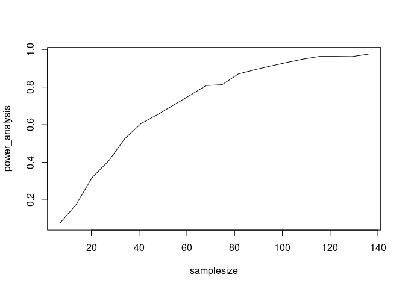

Problem Set 2
================
Alex, Micah, and Scott
12/07/2020

``` r
library(data.table)
library(sandwich)
library(lmtest)

library(ggplot2)
library(knitr)
```

# 1\. What happens when pilgrims attend the Hajj pilgrimage to Mecca?

What happens when a diverse set of people are brought together toward a
common purpose? Maybe it brings people together, or maybe instead it
highlights the differences between groups. [Clingingsmith, Khwaja and
Kremer (2009)](https://dash.harvard.edu/handle/1/3659699) investigate
the question. by asking Pakistani nationals to provide information about
their views about people from other nations.

The random assignment and data is collected in the following way
(detailed in the paper):

  - Pakistani nationals apply for a chance to attend the Hajj at a
    domestic bank. Saudi Arabia agreed in the time period of the study
    (2006) to grant 150,000 visas.
  - Of the 135,000 people who applied for a visa, 59% of those who
    applied were successful.
  - The remainder of the visas were granted under a different allocation
    method that was not randomly assigned, and so this experiment cannot
    provide causal evidence about other allocation mechanisms.
  - Among the 135,000 who apply, the authors conduct a random sample and
    survey about these respondents views about others.

Using the data collected by the authors, test, using randomization
infernece, whether there is a change in beliefs about others as a result
of attending the Hajj.

  - Use, as your primary outcome the `views` variable. This variable is
    a column-sum of each respondent’s views toward members of other
    countries.
  - Use, as your treatment feature `success`. This variable encodes
    whether the respondent successfully attended the Hajj.

<!-- end list -->

``` r
library(data.table)

d <- fread("../data/clingingsmith_2009.csv")
d <- data.table(d)
d[success == 1, sum(success)]
```

    ## [1] 510

##### 1\. State the sharp-null hypothesis that you will be testing.

The sharp-null hypothesis for no treatment effect in this case is that
there should be no change in belief (about people from other countries)
in the minds of those who attended Hajj (won the Hajj lottery) as
compared to those who did not attend Hajj.

To explain further, we have measured the belief of those who attended
Hajj vs. those who did not. Therefore here we have two unrelated (i.e.,
independent or unpaired) groups of samples (attended Hajj vs. not
attended Hajj). Therefore, it’s possible to use an independent t-test to
evaluate whether the means (of their beliefs) are different. We can
represent this null hypothesis as `H0:mA = mB` where `mA = belief of
those attended Hajj` and `mB = beliefs of those not attended Hajj`.

##### 2\. Using `data.table`, group the data by `success` and report whether views toward others are generally more positive among lottery winners or lottery non-winners. This answer should be of the form `d[ , .(mean_views = ...), keyby = ...]` where you have filled in the `...` with the appropriate functions and varaibles.

``` r
hajj_group_mean <- d[ , .(mean_views = mean(views)), keyby = .(success)]  
hajj_ate        <- hajj_group_mean[ , mean(mean_views), keyby = .(success)][ , diff(V1)]

hajj_group_mean
```

    ##    success mean_views
    ## 1:       0   1.868304
    ## 2:       1   2.343137

Here we conduct the calculations required in the problem statement and
find estimated ATE to be 0.4748337. The class type of `hajj_ate` is
numeric.

But is this a “meaningful” difference? Or, could a difference of this
size have arisen from an “unlucky” randomization? Conduct 10,000
simulated random assignments under the sharp null hypothesis to find
out. (Don’t just copy the code from the async, think about how to write
this yourself.)

``` r
# We first create a randomize function to return a vector that randomly returns 0s and 1s. 
# This will be used to distort the treatment effect column in the original dataset and 
# thus create the randomized control trials between treatments and control groups.
randomize <- function(units_per_group) { 
  assignment_vector <- rep(c(0, 1), each = units_per_group)
  sample(assignment_vector)
} 

# Here we are simply allocating treatment and control in a totally random manner to members of the sample. 
# By doing so, we ignore the initial lable of treatment and control, 
# and create our own labels. Those are then used to calculate 
# new group means and new estimated treatment effect.
ri <- function(rand_num, simulations=10000) {
  res <- NA   
  for(sim in 1:simulations) { 
    res[sim] <- d[ , .(group_mean = mean(views)), keyby = .(randomize(rand_num))][ , diff(group_mean)]
  }
  return(res)
}
```

``` r
hajj_ri_distribution <- ri(d[,.N]/2)
```

We have now performed our randomized inference trials on the given
dataset. The length of the new RI distribution vector returned is 10000
(which is equal to the number of simulation we ran).

##### 3\. How many of the simulated random assignments generate an estimated ATE that is at least as large as the actual estimate of the ATE? Conduct your work in the code chunk below, saving the results into `hajj_count_larger`, but also support your coding with a narrative description. In that narrative description (and throughout), use R’s “inline code chunks” to write your answer consistent with each time your run your code.

``` r
hajj_count_larger <- sum(hajj_ri_distribution > hajj_ate)
```

`hajj_count_larger` variable calculates to be 11.

There are only 11 instances where simulated random assignments generate
an estimated ATE that is at least as large as the actual estimate of the
ATE (thus we see that the number of simulated random assignments that
generate an estimated ATE that is at least as large as the actual
estimate of the ATE is a very small number).

##### 4\. If there are `hajj_count_larger` randomizations that are larger than `hajj_ate`, what is the implied *one-tailed* p-value? Both write the code in the following chunk, and include a narrative description of the result following your code.

``` r
hajj_one_tailed_p_value <- mean(hajj_ri_distribution > hajj_ate) #'fill this in' # length 1 numeric vector 
```

As calculated above, the `hajj_one_tailed_p_value` variable shows the
one-tailed p-value to be 0.0011.

Essentially, with a one-tailed p-value of we are assuming a hypothesis
about the direction of an effect – whereby we wish to maximize our
ability to detect the improvement due to Hajj (i.e. we are confident
that taking Hajj will improve the perception about folks from other
countries). However, we run a risk of not detecting the opposite side of
the effect here (i.e. going for a Hajj could also significantly reduce
the perception about people from other countries).

Here the question being posed is whar is probability of observing a
treatment effect greater (in absolute scale) than what was observed,
given that the sharp-null hypothesis were true?

In this instance however, we get a one tailed p-value of 0.0011.

5.  Now, conduct a similar test, but for a two-sided p-value. You can
    either use two tests, one for larger than and another for smaller
    than; or, you can use an absolute value (`abs`). Both write the code
    in the following chunk, and include a narrative description of the
    result following your code.

<!-- end list -->

``` r
hajj_two_tailed_p_value <- mean(abs(hajj_ri_distribution) > abs(hajj_ate))
```

We get a two-tailed p-value of 0.0028 here. This implies that if the
sharp null hypothesis were true, then it would be possible to see a
treatment effect larger than that generated in our experiment in more
than 0.3% of the possible randomization vectors.

Now, given that 0.3% is much smaller than the universally accepted 5%
significant p-value, we can safely assume that it is extremely rare for
us to observe a treatment effect at least as large as the estimated
treatment effect. Therefore, we reject the sharp-null hypothesis of no
treatment effect (i.e. a no-change in belief about others as a result of
attending the Hajj)

# 2\. Randomization Inference Practice

Suppose that you’ve been hired as the data scientist at a quack
nootropics company. Despite their fraudulent intent, you’re dedicated to
doing good data science. Or, at least science as good as you can.

Their newest serum, *kniht* purports to raise its users’ executive
function. You think that it is just amphetamines.

As the data scientist for the company, you convince them to conduct a
trial. Great\! The good news is this:

  - Each person is measured twice.
  - Before one of the measurements, they are given a placebo. Before the
    other of the measurements they are given *kniht*.
  - You ask for instrumentation on two concepts:
      - Creativity, measured as number of proposed alternative uses of
        an object. (This is a classic, test of “creativity”, proposed by
        J.P. Guilford. For example, how many things can you propose
        doing with a camera tripod? )
      - Physical Arousal, measured through skin conductance (i.e. how
        sweaty is someone).

The bad news is this: The company knows that they’re selling nonsense,
and they don’t want you to be able to prove it. They reason that if they
provide you only six test subjects, that you won’t be able to prove
anything, and that they can hide behind a “fail-to-reject” claim.

``` r
library(data.table)

kniht <- data.table(
  person  = rep(LETTERS[1:6], each = 4), 
  treat   = rep(0:1, each = 2), 
  measure = rep(c('creative', 'sweat'))
)


kniht[measure == 'creative' & treat == 0, 
      value := c(10, 13, 14, 16, 25, 40)]
kniht[measure == 'creative' & treat == 1, 
      value := c(12, 11, 13, 20, 21, 46)]
kniht[measure == 'sweat' & treat == 0, 
      value := c(0.4, 0.7, 0.3, 0.8, 1.0, 1.4)]
kniht[measure == 'sweat' & treat == 1, 
      value := c(0.4, 0.7, 2.0, 0.9, 1.6, 2.2)]
```

Conduct the following tests.

#### 1\. Conduct the appropriate t-test that respects the repeated-measures nature of the data (is this a paired or independent samples t-test?) for both the `creative` and the `sweat` outcomes. After you conduct your tests, write a narrative statement about what you conclude.

``` r
t_test_creative <- t.test(value ~ treat, data = kniht[measure=='creative'], paired = TRUE) 
```

Calculated a t-test and saved the object in `t_test_creative`. We obtain
a p-value using formula `t_test_creative$p.value` and find it’s value to
be 0.6156877

``` r
t_test_sweat <- t.test(value ~ treat, data = kniht[measure=='sweat'], paired = TRUE) 
```

Calculated a t-test and saved the object in `t_test_sweat`. We obtain a
p-value using formula `t_test_sweat$p.value` and find it’s value to be
0.105592

This is a paired samples t-test because we are noting pre- and
post-treatment effects of *kniht* on the same person. In such situation,
we use a paired t-test to compare the mean difference of treatment
effects before and after intervention. The hypothesis in this case will
be: `H0: m = 0` (where m is the mean of the difference of the before and
after treatment effects).

As we can see from our respective t-tests, p-value for a hypothesis of
no effect of *kniht* on creative abilities is 0.6156877. Going by the
conventional standards of 5% significance, we cannot reject the null
hypothesis of no impact of *kniht* on creative abilities. Similarly, the
large value of 0.105592 also indicates that we fail to reject the null
hypothesis of no effect (at 5% critical value) of *kniht* on physical
arousal on subjects (which is what the specious company really wanted\!)

#### 2\. Conduct the appropriate randomization inference test that respects the repeated-measures nature of the data. After you conduct your tests, write a narrative statement about what you conclude.

``` r
randomize <- function(units_per_group) { 
  assignment_vector <- rep(c(0, 1), each = units_per_group)
  sample(assignment_vector)
} 

ri <- function(dt, rand_num = 6, simulations = 10000) {
  res <- NA
  for(sim in 1:simulations) { 
    res[sim] <- dt[ , .(ri_mean = mean(value)), keyby = .(randomize(rand_num))][ , diff(ri_mean)]
  }
  return(res)
}
```

``` r
# Here we calculate the initial test statistic used for the RI process
creative_ate     <- kniht[ measure=='creative', .(mean_views = mean(value)), keyby = .(treat)][, diff(mean_views)]

# This is the right method of randomization. First we are randomizing on the treatment/control 
# at a person level. Then we pass that randomized data table to the randomization inference function, 
# which further randomizes across persons. Thus there are two levels of randomization here. 

# Therefore, in this manner, we are preserving the person-level treatment effect. We first randomize (or distort)
# the allocation of the initial treatment-control values for each person by using the sample(c(-1,1),1) function 
# which randomly returens -1 and 1 (that is then multiplies by the treatment effect for each person -- which is 
# calculated using the group-by at each person level).

# Then we use the RI() function to conduct the randomized experiements across the entire dataset.

kniht_creative <- kniht[ measure=='creative',.(value = diff(value * sample(c(-1,1),1))), by = .(person)] 
creative_ri    <- ri(kniht_creative, 3)

creative_p_value <- mean(abs(creative_ri) > abs(creative_ate))

plot(density(creative_ri))
```

<!-- -->

So we we first `group by` at person level. Because we have a paired
assignment (we are already given a treatment-control science fiction
table). We are therefore assuming that all things have been equal before
and after the treatment was given to each person. However, in our
randomization experiment, we wish to remove that “treatment-control”
order (at the person level) and assign these random treatment-control
values to each person, in each iteration.

Here is how the data initially looks like:

|        |       |          |       |
| ------ | ----- | -------- | ----- |
| person | treat | measure  | value |
| A      | 0     | creative | 10    |
| A      | 1     | creative | 12    |
| B      | 0     | sweat    | 11    |
| B      | 1     | sweat    | 12    |

To conduct our experiment, we first wish to group by at person level (by
randomly calculating treatments and controls based on the “value”
column). Below is one example of how that grouped data might look like.

|        |       |
| ------ | ----- |
| person | value |
| A      | 2     |
| B      | \-2   |
| C      | \-1   |
| D      | 4     |

Later on, we pass this above data table to randomization inference loop
repeatedly. Note, that the “value” column might change, based on how the
treatment and control assignment had happened at the grouped person
level.

Similar work is done for the `sweat` measurement (as below):

``` r
sweat_ate     <- kniht[ measure=='sweat', .(mean_views = mean(value)), keyby = .(treat)][, diff(mean_views)]
kniht_sweat <- kniht[ measure=='sweat',.(value = diff(value * sample(c(-1,1),1))), by = .(person)] 
sweat_ri      <- ri(kniht_sweat, 3)

sweat_p_value <- mean(abs(sweat_ri) > abs(sweat_ate))

plot(density(sweat_ri))
```

<!-- -->

The randomization inference is based on the sharp null effect of no
effect (which means that it does not matter whether a person takes a
placebo or *kniht* drug). The sharp null is hypothesizing that there
should be no treatment effect (even if the order is changed) given the
placebo and treatment on every single person in the trial.

To summarize finally, the estimated average treatment effects are and
0.8333333 and 0.5333333 for `creative abilities` and `sweatiness
measure` respectively. Correspondingly, the p-values for randomization
inference tests for both the `creative` and the `sweat` outcomes are 1
and 0.5983 respectively. We therefore fail to reject the sharp null
hypothesis under the 0.05 standard of statistical significance in this
case.

#### 3\. Which of these tests are more appropriate to the task at hand, and why? Based on the tests that you have run, what do you conclude about the effectiveness of *kniht*?

In this instance we only have data for 6 people, which to say the least,
is highly insufficient, let alone normally distributed.

The conventional t-tests rely on various assumptions, such as data, when
plotted, should result in a normal distribution. We also dont find most
of the other assumptions under t-tests not being held here (such as the
scale of measurement, simple random samples, normal distribution,
reasonably large sample size and homogeneity of variance).

[Gerber and
Green](https://stats.stackexchange.com/questions/287407/t-test-p-value-vs-randomization-inference-p-value-what-can-we-learn-from-compar)
also talks about the limitation of t-tests in similar instances of small
sample size and skewness of data.

Hence the steep difference in p-values between the randomization
inference and the conventional t-test methods (they would be close if
the sample size was large enough).

Therefore, in this case using a randomization inference based p-value
does make sense (because the approach is not limited to small samples or
normally distributed outcomes).

Finally, given the large p-values using the RI 1 and 0.5983, we fail to
reject the sharp null hypothesis of no treatment effect of *kniht* under
the 0.05 standard of statistical significance (if we were to reject the
sharp null hypothesis, that would have meant that the *kniht* drug was
in fact effective\!).

# 3\. Sports Cards

In this experiment, the experimenters invited consumers at a sports card
trading show to bid against one other bidder for a pair trading cards.
We abstract from the multi-unit-auction details here, and simply state
that the treatment auction format was theoretically predicted to produce
lower bids than the control auction format. We provide you a relevant
subset of data from the experiment.

In this question, we are asking you to produce p-values and confidence
intervals in three different ways:

1.  Using a `t.test`;
2.  Using a regression; and,
3.  Using randomization inference.

<!-- end list -->

``` r
library(data.table)

d <- fread('../data/list_data_2019.csv')
bid_ate <- d[ , .(mean_views = mean(bid)), keyby = .(uniform_price_auction)][, diff(mean_views)]
```

First we load the data and also calculate our estimate of average
treatment effect (a.k.a our test statistic) under the sharp null
hypothesis that the treatment auction format produces no different bids
than the control auction format. Our estimated average treatment effect
is -12.2058824.

##### 1\. Using a `t.test`, compute a 95% confidence interval for the difference between the treatment mean and the control mean. After you conduct your test, write a narrative statement, using inline code evaluation that describes what your tests find, and how you interpret these results. (You should be able to look into `str(t_test_cards)` to find the pieces that you want to pull to include in your written results.)

``` r
# t_test_cards <- t.test(bid ~ uniform_price_auction, data = d, paired = FALSE, alternative = "two.sided") # this should be the t.test object. Extract pieces from this object in-text below the code chunk. 
t_test_cards <- t.test(d[uniform_price_auction==1,bid], d[uniform_price_auction==0,bid])

str(t_test_cards)
```

    ## List of 10
    ##  $ statistic  : Named num -2.82
    ##   ..- attr(*, "names")= chr "t"
    ##  $ parameter  : Named num 62
    ##   ..- attr(*, "names")= chr "df"
    ##  $ p.value    : num 0.00642
    ##  $ conf.int   : num [1:2] -20.85 -3.56
    ##   ..- attr(*, "conf.level")= num 0.95
    ##  $ estimate   : Named num [1:2] 16.6 28.8
    ##   ..- attr(*, "names")= chr [1:2] "mean of x" "mean of y"
    ##  $ null.value : Named num 0
    ##   ..- attr(*, "names")= chr "difference in means"
    ##  $ stderr     : num 4.33
    ##  $ alternative: chr "two.sided"
    ##  $ method     : chr "Welch Two Sample t-test"
    ##  $ data.name  : chr "d[uniform_price_auction == 1, bid] and d[uniform_price_auction == 0, bid]"
    ##  - attr(*, "class")= chr "htest"

Our t-test is based on the hypothesis that bid price for treatment
auction format is equal to the control auction format. Therefore, when
we conduct a t-test and find a p-value of 0.0064208, we find that it is
significantly smaller than the critical value of 0.05 needed to reject
the null hypothesis at 95% confidence interval. Therefore, with this
t-test we can reject the null hypothesis that the bid price for
treatment auction format is equal to the control auction format.

Furthermore, our t-test calculates a 95% confidence of having the
estimate of average treatment effect of -12.2058824 falling between the
range of -20.8546241 and -3.5571406 (calculated using formula
-20.8546241, -3.5571406)

##### 2\. In plain language, what does this confidence interval mean?

There is 95% probability that the true value of the unknown population
parameter (difference between treatment and control mean) will lie
within -20.8546241 and -3.5571406

##### 3\. Conduct a randomization inference process using an estimator that you write by hand (i.e. in the same way as earlier questions). On the sharp-null distribution that this process creates, compute the 2.5% quantile and the 97.5% quantile using the function `quantile` with the appropriate vector passed to the `probs` argument. After you conduct your test, write a narrative statement of your test results.

``` r
ri <- function(dt, rand_num, simulations = 10000) {
  res <- NA
  for(sim in 1:simulations) { 
    res[sim] <- dt[ , .(ri_mean = mean(bid)), keyby = .(sample(rep(c(0, 1), each = rand_num)))][ , diff(ri_mean)]
  }
  return(res)
}
ri_distribution <- ri(d, d[,.N]/2)     #'fill this in' # numeric vector of length equal to your number of RI permutations
ri_quantiles    <-  quantile(ri_distribution, probs = c(0.025, 0.975)) 
```

Probably a good idea to sow the quantiles output here:

``` r
ri_quantiles
```

    ##      2.5%     97.5% 
    ## -8.911765  8.911765

We conduct a 10,000 simulated random assignments find out the
distribution of the test statistic under the assumption that the
sharp-null is true. We find that the confidence interval interval
calculated under the random inference simulation falls between
-8.9117647 and 8.9117647.

The reason for different confidence intervals between both approaches is
that when you run a t-test or a difference in means test, the
uncertainty mapping is distributed around the perimeter you are
estimating. On the other hand, when you run a randomization inference
test the confidence interval is distributed centered around 0. The
distribution shifts by the magnitude of the treatment effect, because
the RI hypothesis itelf is centered around zero. However, the confidence
interval for a t-test or a regression coefficient is not centered on
zero (it is centered on the value you estimated for that statistic).

Which makes sense, because even when the RI based confidence interval
has shifted, it does align perfectly with the t-test based confidence
interval (when adjusted for the `-12.3` ATE).

Can be confirmed by this formula `RI confidence interval = t-test based
confidence interval +/- estimate of ATE`.

##### 4\. Do you learn anything different if you regress the outcome on a binary treatment variable? To answer this question, regress `bid` on a binary variable equal to 0 for the control auction and 1 for the treatment auction and then calculate the 95% confidence interval using *classical standard errors* (in a moment you will calculate with *robust standard errors*). There are two ways to do this – you can code them by hand; or use a built-in, `confint`. After you conduct your test, write a narrative statement of your test results.

``` r
mod <- lm(bid ~ uniform_price_auction, data = d)

confint(mod, level=0.95)                        #conf interval using built-in formula
```

    ##                           2.5 %    97.5 %
    ## (Intercept)            22.71534 34.931716
    ## uniform_price_auction -20.84416 -3.567603

``` r
sum_ols <- summary(mod)$coefficients            #extracting OLS summary in an object
```

The OLS based confidence interval produces the same values of confidence
interval.

We see here that we are using the formula `confint(mod, level=0.95)`
results are: 22.7153433, -20.844162, 34.9317155, -3.5676027.

We then proceed to calculate the confidence interval manually by
extracting `coefficients` from the `OLS summary object` using the
formula `summary(mod)$coefficients`.

Here we also see that the results align with our calculations of other
approaches for a 95% confidence interval:

  - `sum_ols[2, 1] + 1.96 * sum_ols[2, 2]` gives a value of -3.7258013
  - `sum_ols[2, 1] - 1.96 * sum_ols[2, 2]` gives a value of -20.6859634

##### 5\. Calculate the 95% confidence interval using robust standard errors, using the `sandwich` package. There is a function in `lmtest` called `coefci` that can help with this. It is also possible to do this work by hand. After you conduct your test, write a narrative statement of your test results.

``` r
library(sandwich)
library(lmtest)

m <- lm(bid ~ uniform_price_auction, data = d)
coefci(m, vcov. = vcovHC(m, type = 'HC0'))
```

    ##                           2.5 %    97.5 %
    ## (Intercept)            22.08324 35.563822
    ## uniform_price_auction -20.71618 -3.695584

With the `sandwich` package, we also see that the robust standard errors
come very close to what we had calculated in other prior methods.

##### 6\. Characterize what you learn from each of these different methods – are the results contingent on the method of analysis that you choose?

We observe, that as noted in part 3 above, there is a shift in
confidence interval around `zero` when using a randomization inference
based method. However, the overall approach does not lead to any
significant difference in test results.

# Power Analysis

Understanding whether your experiment design and data collection
strategy are able to reject the null hypothesis *when they should* is
valuable\! And, this isn’t theoretical value. If your design and data
collection cannot reject the null hypothesis, why even run the
experiment in the first place?

The classical formulation of power asks, “Given a test procedure and
data, what proportion of the tests I *could conduct* would reject the
null hypothesis?”

Imagine that you and David Reiley are going to revive the sports card
experiment from the previous question. However, because it is for a
class project, and because you’ve already spent all your money on a
shiny new data science degree :raised\_hands: :money\_with\_wings: ,
you’re not going to be able to afford to recruit as many participants
as before.

##### 1\. Describe a t-test based testing procedure that you might conduct for this experiment. What is your null hypothesis, and what would it take for you to reject this null hypothesis? (This second statement could either be in terms of p-values, or critical values.)

Given that we our data here meets assumptions for t-test (i.e. scale of
measurement applied to the data collected follows a continuous or
ordinal scale, the data is collected from a representative, randomly
selected portion of the total population and when plotted it follows a
normal distribution with homogeneity of variances), we use an unpaired
two-samples t-test (which is usually used to compare the mean of two
independent groups).

Here we could state our null hypothesis as `H0 : mA = mB` where `mA =
mean of the price bids of the treatment auction format` and `mB = mean
of the price bids of the control auction format`

We would reject the null hypothesis if we find a p-value which is lower
than `5% critical value` or `under the 0.05 standard of statistical
significance`. Rejecting the null hypothesis would then mean that we
have found evidence that the treatment auction format does produce a
difference bid price than the control auction format.

##### 2\. Suppose that you are only able to recruit 10 people to be a part of your experiment – 5 in treatment and another 5 in control. Simulate “re-conducting” the sports card experiment once by sampling from the data you previously collected, and conducting the test that you’ve written down in part 1 above. Given the results of this 10 person simulation, would your test reject the null hypothesis?

``` r
library(data.table)
library(ggplot2)

# load data and calculate estimate of ATE
d <- fread('../data/list_data_2019.csv')
bid_ate     <- d[ , .(mean_views = mean(bid)), keyby = .(uniform_price_auction)][, diff(mean_views)]
```

First we load the data and also calculate our estimate of average
treatment effect (a.k.a our test statistic) under the sharp null
hypothesis that the treatment auction format produces no different bids
than the control auction format. Our estimated average treatment effect
is -12.2058824.

``` r
t_test_gen <- function(dt, treat_control_size, REPL_FLAG) {
  # This function takes three arguments: (1) dataframe (2) half of sample size for which to run t-tes and 
  # (3) replacement (yes/no) flag. Sample size is half of the size for which we want to run erxperiment. 
  # Because we allocate equal numbers to treatment and control groups. Replacement flag tells whether we want to 
  # randomly sample with replacement or without. For example, if your sample size chosen is larger than the 
  # actual experimental sample, then you should pass replacement flag as TRUE
  
  return(try(t.test(
                  sample(dt[uniform_price_auction==1, (bid)], treat_control_size, replace=REPL_FLAG),
                  sample(dt[uniform_price_auction==0, (bid)], treat_control_size, replace=REPL_FLAG)
                )$p.value
         ))
}
```

``` r
t_test_ten_people <- t_test_gen(d, 5, FALSE)
```

For our 10 person simulation above, we have created a generic function
that takes as inputs the dataframe copy on which to randomize, the
number of subjects for which we have to randomize, a boolean flag that
indicates whether we want to randomize with or without replacement.

The randomization with or without replacement is an important point
here. If we randomize without replacement (as long as the number of
samples for randomization is smaller than the total sample size), there
is more likelihood that we are picking outliers. In which case, the
probability of finding values closer to the estimated expected test
statistic (expected value of ATE) goes down. If we run a t-test with
replacement, our probability of finding values closer to the expected
test statistic are higher (which then leads to a higher power).

In our case above, when we run our t-test without replacement, our
p-values are USUALLY large enough at 0.9679422 that we fail to reject
the null hypothesis.

##### 3\. Now, repeat this process – sampling 10 people from your existing data and conducting the appropriate test – one-thousand times. Each time that you conduct this sample and test, pull the p-value from your t-test and store it in an object for later use. Consider whether your sampling process should sample with or without replacement.

``` r
t_test_p_values <- replicate(1000, t_test_gen(d, 5, FALSE)) # fill this in with the p-values from your power analysis
```

As mentioned above, because we are only using data for 10 subjects at a
time, we can run our t-test randomized without replacement (since the
total sample size is larger than 10).

##### 4\. Use `ggplot` and either `geom_hist()` or `geom_density()` to produce a distribution of your p-values, and describe what you see. What impression does this leave you with about the power of your test?

``` r
ggplot(as.data.frame(t_test_p_values), aes(x=t_test_p_values)) +
  geom_histogram(color="darkblue", fill="lightblue", binwidth = 0.01)
```

<!-- -->

``` r
t_test_p_values_power <- mean(t_test_p_values < 0.05)
```

After having run the randomization t-tests (without replacement), we see
that the distribution of p-values is much flatter than what we would
ideally want in order to have a high power (more confidence in being
able to reject our null hypothesis). As seen above from the histogram
distribution of p-values, we see that roughly `15%` of p-values are
(0.109 to be precise) are below the 0.05 critical value threshold.
Ideally, we would have wanted a much larger percentage of p-values to be
under the `0.05` value (we would have wanted to distribution to be very
heavily right skewed) for a higher power.

##### 5\. Suppose that you and David were to actually run this experiment and design – sample 10 people, conduct a t-test, and draw a conclusion. **And** suppose that when you get the data back, **lo and behold** it happens to reject the null hypothesis. Given the power that your design possesses, does the result seem reliable? Or, does it seem like it might be a false-positive result?

As mentioned above, the power we get is 0.109 only. This is not ideal.
We would want the power to be at least `80%` to be reliable (remember
power is the ability to correctly reject the null hypothesis).

6.  Apply the decision rule that you wrote down in part 1 above to each
    of the simulations you have conducted. What proportion of your
    simulations have rejected your null hypothesis? This is the p-value
    that this design and testing procedure generates. After you write
    and execute your code, include a narrative sentence or two about
    what you see.

<!-- end list -->

``` r
# find out how many p values are less than 0.05
t_test_rejects <- sum(t_test_p_values < 0.05)
```

We see that 109 p-values are less than the important threshold `0.05
standard of statistical significance`. This means that the p-value of
our test is 0.109 which is not sufficient to reject the null hypothesis.

##### 7\. Does buying more sample increase the power of your test? Apply the algorithm you have just written onto different sizes of data. Namely, conduct the exact same process that you have for 10 people, but now conduct the process for every 10% of recruitment size of the original data: Conduct a power analysis with a 10%, 20%, 30%, … 200% sample of the original data. (You could be more granular if you like, perhaps running this task for every 1% of the data).

``` r
percentages_to_sample <- 0.1
counter <- 1
samplesize <- NA
power_analysis <- NA

while (percentages_to_sample < 2.1) {
  samplesize[counter] <- percentages_to_sample * nrow(d)
  p_vals <- replicate(1000, t_test_gen(d, samplesize[counter]/2, TRUE))
  power_analysis[counter] <- mean(p_vals < 0.05)
  cat(sprintf('Sample size: %.2f, Power: %.3f\n', samplesize[counter], power_analysis[counter]))
  percentages_to_sample <- percentages_to_sample + 0.1
  counter <- counter + 1
}
```

    ## Sample size: 6.80, Power: 0.076
    ## Sample size: 13.60, Power: 0.175
    ## Sample size: 20.40, Power: 0.320
    ## Sample size: 27.20, Power: 0.407
    ## Sample size: 34.00, Power: 0.525
    ## Sample size: 40.80, Power: 0.606
    ## Sample size: 47.60, Power: 0.653
    ## Sample size: 54.40, Power: 0.704
    ## Sample size: 61.20, Power: 0.755
    ## Sample size: 68.00, Power: 0.808
    ## Sample size: 74.80, Power: 0.813
    ## Sample size: 81.60, Power: 0.870
    ## Sample size: 88.40, Power: 0.892
    ## Sample size: 95.20, Power: 0.912
    ## Sample size: 102.00, Power: 0.931
    ## Sample size: 108.80, Power: 0.949
    ## Sample size: 115.60, Power: 0.963
    ## Sample size: 122.40, Power: 0.963
    ## Sample size: 129.20, Power: 0.962
    ## Sample size: 136.00, Power: 0.975

``` r
plot(x = samplesize, y = power_analysis, type = 'l')
```

<!-- -->

Here we conduct the simulation, scaling from 10% of sample size all the
way up to 200% of sample size. We do this WITH REPLACEMENT, because the
randomization would extend beyond the sample size.

We observe that as we increase samples in our experiment, the power of
the experiment goes up. This is expected from our earlier comments (and
more so, more importantly in experiments with replacement) because with
more samples the probability of finding observations at least as large
as the expected test statistic increase – which leads to a higher
confidence in being able to correctly reject the null hypothesis.

In other words, here we observe that when you add more people (and add
more data) and conduct tests more cleanly (with cleaner measurement
systems), your power increases correspondingly.

Additionally the above chart of increasing power with increasing sample
size clearly illustrates that sometimes it is difficult to reject the
null hypothesis because you have so little statistical power (because
you have so few samples). So in order to evaluate a siginificant
difference in experiment, you need to have more samples\!
