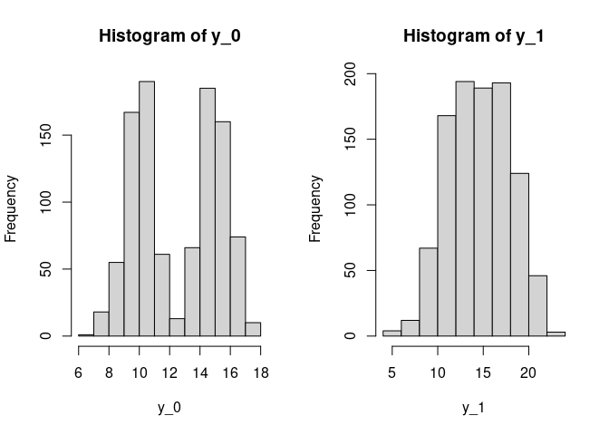

R Notebook
================

# Potential Outcomes

The concept of potential outcomes are foundational to the reasoning
system that we’re going to use for the course. They allow us to think
about, with considerably clarity, the comparisons that we want to make,
and **exactly** why these comparisons are *causal*.

But, despite the somewhat obtuse language that we might use when we’re
talking about potential outcomes (e.g. “The potential outcome to
treatment, when a unit is assigned to treatment.”) the math surrounding
potential outcomes is actually pretty straightforward.

# Create Data

Let’s make some toy data that we can use through this demo.

Suppose that we have 1,000 individuals that we can observe in our study.
Furthermore, suppose that for each of these people, there is some
*latent*, or unmeasured, response to treatment that they *would* have to
treatment if we assigned them to take the treatemnt.

You might think of this as an unknowable population-level parameter that
we’re trying to estimate from empirical data. In this worksheet, we’re
going to make the data so that the causal parameter \(\tau\) has a mean
value of 2. But, you could imagine that some other treatment has a mean
value of 100. Or, for some third treatment it could have a mean value of
zero, in which case we would say there there is *no* treatment effect.

For concreteness, suppose that the treatment is assigning people to
drink [coffee](https://www.aldeacoffee.com).

Create a data.table with the following columns:

1.  An `id` column that ranges from 1 to the number of rows in the
    data.table.
2.  A `tau` column that has random draws from the normal distribution.
    Set the mean of these draws to be two, and the standard deviation to
    also be two.

<!-- end list -->

``` r
library(data.table)

NROWS <- 1000 

d <- data.table(
  id=1:1000
)
d[, tau :=rnorm(n = .N, mean = 2, sd = 2)]

d
```

    ##         id         tau
    ##    1:    1  0.18614184
    ##    2:    2  0.64904596
    ##    3:    3  0.01859793
    ##    4:    4  0.62921875
    ##    5:    5  0.85207688
    ##   ---                 
    ##  996:  996  2.37452893
    ##  997:  997  2.32294309
    ##  998:  998  4.62237888
    ##  999:  999  2.51787405
    ## 1000: 1000 -2.03765464

Let’s build more into our data, like, that some of the people are tall,
while others are short; and some are young, while others are old.

Make two new colums, using the `:=` assignment operator in the
data.table. We’ll make the first column for you. You produce the second
column.

1.  `Height` which is random draws of either ‘tall’ or ‘short’.
2.  `Age` which is random draws of either ‘young’ or ‘old’.

<!-- end list -->

``` r
d[ , height := sample(c('tall', 'short'), size = .N, replace = TRUE)]
d[ , age := sample(c('young', 'old'), size = .N, replace = TRUE)]
```

In just exactly the same way, we can also think of our units having
levels of *potential outcomes to control*. That is, we can suppose that
people have some level of the outcome in the case that they do not drink
any coffee. For concreteness, suppose that the outcome is people’s
number of minutes of 241 coding they can accomplish, before they fall
asleep.

There might (or might not) be a relationship between our
non-experimentally assigned outcomes. In the example we’re working with
here, suppose that there is no relationship between height and minutes
of coding; but that there is a positive relationship between age and
minutes of coding.

This might be represented in our data in the following way: The mean
number of minutes that someone can work is 10, plus, if they’re old
(ahem… seasoned, disciplined) they are able to work for an additional 5
minutes on avergae. But, also assume that there is some noise in this
relationship.

Create a column on the data called `y_0` that takes the following
values.

  - If the preson is young, it takes the value of 10.
  - If the person is old, it takes the value of 15.
  - For both young and old people add in a little bit of *noise* a a
    draw from a random normal distribution with `mean=0` and `sd=1`.

There are a couple of ways that you can do this. While you may be
tempted to subset your data; this is probably less efficient that it
could be.

  - Either use an `ifelse` statement, which is still not maximally
    performant; or,
  - Use an evaluation statement using the `I()` “as is” operator.

<!-- end list -->

``` r
d[age == 'young', y_0 := 10 + rnorm(n = .N , mean = 0, sd = 1)]
d[age == 'old', y_0 := 15 + rnorm(n = .N , mean = 0, sd = 1)]

d
```

    ##         id         tau height   age       y_0
    ##    1:    1  0.18614184  short young 11.510675
    ##    2:    2  0.64904596   tall young 10.542454
    ##    3:    3  0.01859793  short   old 14.400289
    ##    4:    4  0.62921875  short   old 15.190560
    ##    5:    5  0.85207688  short   old 13.396457
    ##   ---                                        
    ##  996:  996  2.37452893   tall   old 13.719527
    ##  997:  997  2.32294309  short young 10.055714
    ##  998:  998  4.62237888  short   old 14.927122
    ##  999:  999  2.51787405   tall   old 15.328222
    ## 1000: 1000 -2.03765464   tall young  7.093976

``` r
d[, .(average_y_0 = mean(y_0)), by = .(age) ]
```

    ##      age average_y_0
    ## 1: young    9.957329
    ## 2:   old   14.994213

Notice that there is no relationship between height and potential
outcomes to control; and also notice that the “noise” in the
relationship is represented in the draw from the normal distribution
with mean 0.

## Potential Outcomes to Treatment

If we know people’s potential outcomes to control, and we already know
each persons *causal effect*, then I suppose we also know their
potential outcomes to **treatment**, right?

Create people’s potential outcomes to treatment, `y_1` as the sum of
their `y_0` and `tau` values.

``` r
d[ , y_1 := y_0 + tau]
```

And so, we can represent this **science table** – the set of all
potentially realizable outcomes, and also measurable covariates.

``` r
head(d)
```

    ##    id         tau height   age      y_0      y_1
    ## 1:  1  0.18614184  short young 11.51068 11.69682
    ## 2:  2  0.64904596   tall young 10.54245 11.19150
    ## 3:  3  0.01859793  short   old 14.40029 14.41889
    ## 4:  4  0.62921875  short   old 15.19056 15.81978
    ## 5:  5  0.85207688  short   old 13.39646 14.24853
    ## 6:  6 -0.05280505   tall   old 14.86737 14.81456

## Questions for Understanding

First, answer these based on your understanding of how you created the
data. Then, answer them using calls and subset against the data. This is
*easy* practice for querying the data.tables and performing functions on
them.

1.  On average, will people who are older tend to be taller, shorter, or
    about the same height, and people who are younger?
2.  On average, will people who are older tend to have higher or lower
    potential outcomes to control?
3.  On average, will people who are taller tend to have higher or lower
    potential outcomes to treatment?
4.  **Most importantly**: If these are *potential outcomes* then, can we
    empirically observe any of these outcomes?

<!-- end list -->

``` r
par(mfrow = c(1,2))

d[, hist(y_0)]
```

    ## $breaks
    ##  [1]  6  7  8  9 10 11 12 13 14 15 16 17 18
    ## 
    ## $counts
    ##  [1]   1  18  55 167 190  61  13  66 185 160  74  10
    ## 
    ## $density
    ##  [1] 0.001 0.018 0.055 0.167 0.190 0.061 0.013 0.066 0.185 0.160 0.074 0.010
    ## 
    ## $mids
    ##  [1]  6.5  7.5  8.5  9.5 10.5 11.5 12.5 13.5 14.5 15.5 16.5 17.5
    ## 
    ## $xname
    ## [1] "y_0"
    ## 
    ## $equidist
    ## [1] TRUE
    ## 
    ## attr(,"class")
    ## [1] "histogram"

``` r
d[, hist(y_1)]
```

<!-- -->

    ## $breaks
    ##  [1]  4  6  8 10 12 14 16 18 20 22 24
    ## 
    ## $counts
    ##  [1]   4  12  67 168 194 189 193 124  46   3
    ## 
    ## $density
    ##  [1] 0.0020 0.0060 0.0335 0.0840 0.0970 0.0945 0.0965 0.0620 0.0230 0.0015
    ## 
    ## $mids
    ##  [1]  5  7  9 11 13 15 17 19 21 23
    ## 
    ## $xname
    ## [1] "y_1"
    ## 
    ## $equidist
    ## [1] TRUE
    ## 
    ## attr(,"class")
    ## [1] "histogram"

# Run Your Experiment

To this point, we’ve been working in the *potential outcomes space*. One
way that you might think about this is as though these are the
measurement that our population of people are going to walk into the
expeiment having – but we haven’t measured them yet, so we don’t know
what they are\! That is, suppose we have the whole cohort of students
who are enrolled in 241, and they’re going to start the coffee drinking
experiment in Week 3. In Week 2, they all are either young/old,
short/tall, and have innate abilities to focus, *we as the experimenters
just don’t know them yet\!*.

When we run the experiment, we accomplish several things:

1.  We measure outcomes from our subjects;
2.  We intervene in their lives to force a particular experience;
3.  As a result of our intervention, we *reveal* either potential
    outcomes to treatment or control for each subject, and we measure
    this.

The first of these is easy: For every subject, no matter whether they
are in treatment or control, we measure the trait that we care about.
But, the second two require consierably more care, and are the focus of
the class.

In this experiment, the way that we are interviening in people’s lives
is to either give them *coffee* or *decaf coffee*. Then, and only then,
we’re also able to make some of their potential outcomes measurable.

Make two final columns:

1.  Create variable `treat` and randomly assign people to be either in
    the treatment group or the control group.
2.  Create a variable `Y` that is the potential outcome that we
    *actually* observe in the experiment. If the person is assigned to
    the treatment group, fill `Y = y_1`; and, if they’re assigned to the
    control group fill `Y = y_0`.

<!-- end list -->

``` r
d[, treat := sample(1:0, .N, replace = TRUE)]
d[, Y := ifelse(test = treat ==1, yes = y_1, no = y_0)]


d
```

    ##         id         tau height   age       y_0       y_1 treat         Y
    ##    1:    1  0.18614184  short young 11.510675 11.696817     1 11.696817
    ##    2:    2  0.64904596   tall young 10.542454 11.191500     1 11.191500
    ##    3:    3  0.01859793  short   old 14.400289 14.418887     0 14.400289
    ##    4:    4  0.62921875  short   old 15.190560 15.819779     1 15.819779
    ##    5:    5  0.85207688  short   old 13.396457 14.248534     0 13.396457
    ##   ---                                                                  
    ##  996:  996  2.37452893   tall   old 13.719527 16.094055     1 16.094055
    ##  997:  997  2.32294309  short young 10.055714 12.378657     1 12.378657
    ##  998:  998  4.62237888  short   old 14.927122 19.549500     1 19.549500
    ##  999:  999  2.51787405   tall   old 15.328222 17.846096     0 15.328222
    ## 1000: 1000 -2.03765464   tall young  7.093976  5.056321     1  5.056321

## Why only some of?

Why are we only able to measure some of people’s potential outcomes? As
David has identified in the async videos, we’re only able to measure the
potential outcomes that are consistent with the treatment that we
actually give people.

And, so, while the *science table* might contain information about each
persons potential outcomes to treamtent and control, the table of data
that we’re ever going to be able to generate has a more restricted set.
Call this observable data set `obs`, and it is a subset of all the data
that might be out there.

``` r
obs <- d[ , .(id, height, age, treat, Y)]
head(obs)
```

    ##    id height   age treat        Y
    ## 1:  1  short young     1 11.69682
    ## 2:  2   tall young     1 11.19150
    ## 3:  3  short   old     0 14.40029
    ## 4:  4  short   old     1 15.81978
    ## 5:  5  short   old     0 13.39646
    ## 6:  6   tall   old     0 14.86737

Where did all the data go?? We no longer have access to people’s causal
effect (\(\tau\)), nor do we have access to their potential outcomes to
control and treatment. Instead, we’re left only with their *realized
potential outcomes* that match the condition they were assigned to.

## Question of Understanding (Conceptual)

1.  What happens to these values that are no longer in our dataset?
    Because we can’t measure them, does that mean that they don’t exist?
    Does it mean that they *never* existed?
2.  If we can’t see any person’s \(\tau\), then how should we generate
    an estimate of this population-level parameter?

## Questions of Understanding (Numerical)

Use the data.table `d` for these questions.

1.  Is the average height of people who are in treatment more or less
    than the average height for people who are in control?
2.  Among poeple who are in treatment, what is the mean potential
    outcome to control (`y_0`)? Is this any different than the people
    who are in control?
3.  Among people who are in treatment, what is the mean potential
    outcome to treatment (`y_1`)? Is this any different than the people
    who are control?
4.  Among people who are in treatment, what is the average difference
    between the potential outcomes to treatment and potential outcomes
    to control?

# Estimating Causal Quantities from the Observable Data

Of course, we don’t get to see each of these potential outcomes instead,
we only get to see either one or the other. Which one do we get to see?
Well the potential outcome for the treatment condition that we assign
the person to\!

But, though random assignment, the values for the potential outcomes to
control that we see *should* be an unbiased estiamte of the whole
populations potential outcomes to control.

``` r
mean_y0        <- d[ , mean(y_0)]
mean_control_Y <-  obs[treat==0, mean(Y)]

mean_y0
```

    ## [1] 12.49088

``` r
mean_control_Y
```

    ## [1] 12.52621

The meane of `y0` is 12.491, and the menae of control Y is 12.526.

Conduct the same comparison among the treatment group. *Don’t simply
copy paste code; there’s benefit in thinking about the queries and
functions*. Type out each segment, even though its slower.

``` r
mean_y1 <- d[, mean(y_1)]
obs[treat ==1, mean(Y)]
```

    ## [1] 14.59826

Does the result surprise you at all?

# The Big Punchline\!

Because the *observable* set of realised potential outcomes are unbiased
estimates of the *unobservable* potential outcomes, we’re able to
generate an unbiased estimate of the causal effect, using only obsevable
data\!

  - Calculate the mean of the observable potential outcomes to
    treatment.
  - Calcualte the mean of the observable potential outcomes to control.
  - Then, calculate the difference between the two of these quantities.
  - How close is this \(\hat{\tau}\) to the true \(\tau\) that you
    created in the first code cell?

<!-- end list -->

``` r
obs[treat ==1, mean(Y)] - obs[treat ==0, mean(Y)]
```

    ## [1] 2.072052

Let that sink in a bit. Most of your job as a data scientist *not* in
producing some results; most of your job as a data scientist is in
producing reuslts that are the *right* results, and that requires
thought.
